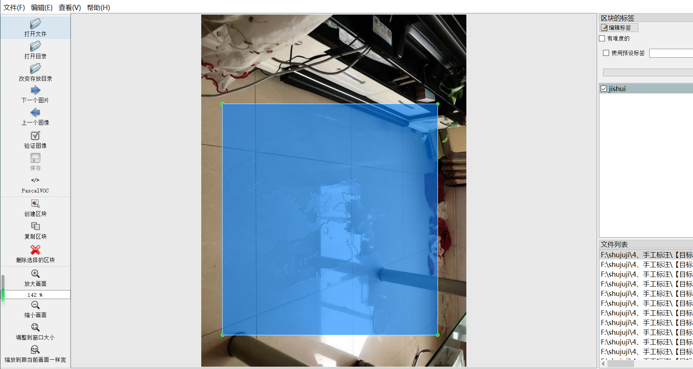
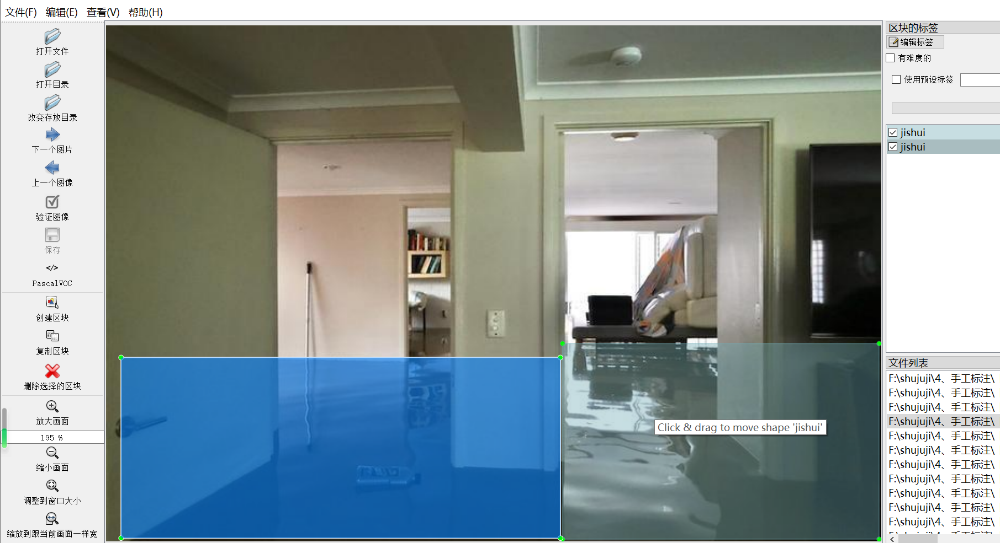
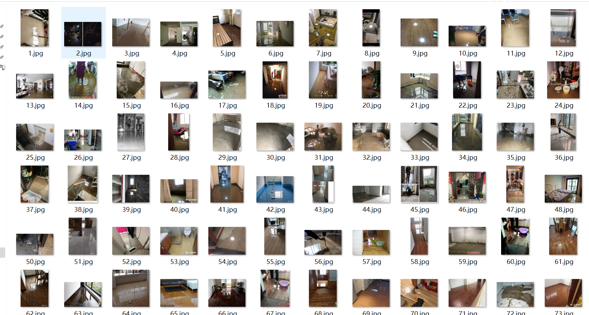

# [Object Detection Dataset] Indoor Room Inside Waterlogging Detection Dataset

The dataset format is Pascal VOC with a YOLO extension (excluding the split path in the txt file, only containing JPG images along with their corresponding VOC XML files and YOLO txt files).

Number of images (JPG file count): 357

Number of annotations (XML file count): 357

Number of annotations (txt file count): 357

Number of annotation categories: 1

Annotation category names: ["jishui"]

Box count for each category:

- "jishui" boxes = 378

Total box count: 378

Annotation tool used: labelImg

Annotation rules: draw bounding boxes for each category

Important note: The images are collected from web scraping and self-organized afterward, which is original content and should not be copied without permission.

Image overview:

Annotation details:

## Images

---

Here is a pay link on Stripe (https://buy.stripe.com/3cs8yP7sY87d0vu9AB). Please contact me lonlonago@foxmail.com after funding $89, and I will send you a complete data files, thank you!

